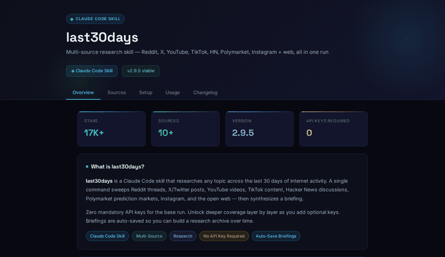

# htmlify

Give Claude any content. Get a beautiful, tabbed HTML reference file back.

README. Handoff doc. GitHub repo. Raw notes. Article. Anything.

---

**Turn this:**

```
/htmlify https://github.com/TauricResearch/TradingAgents
```

**Into this:**


---

## Who is this for?

You're reading a README, a handoff doc, or a long article and you want it laid out clearly. No more squinting at raw markdown or scrolling through walls of text.

Paste the link or the content. htmlify converts it into a clean, dark-themed HTML file with tabs, stat cards, tables, and code blocks. Open it in your browser. Done.

---

## What the output looks like

**GitHub READMEs with overview stats, agent tables, setup instructions:**



**Deep dive into agents, setup, and config tabs:**


---

## Live demo

**[htmlify-skill.vercel.app](https://htmlify-skill.vercel.app)** · sample outputs live in your browser.

| Sample | Live |
|---|---|
| TradingAgents README | [htmlify-skill.vercel.app/trading-agents-reference](https://htmlify-skill.vercel.app/trading-agents-reference) |
| last30days-skill README | [htmlify-skill.vercel.app/last30days-reference](https://htmlify-skill.vercel.app/last30days-reference) |

---

## How to use

**Install (Claude Code):**

```bash
# If you have the add-skill helper:
/add-skill https://github.com/Zyphyrs/htmlify-skill

# Or manually:
git clone https://github.com/Zyphyrs/htmlify-skill /tmp/htmlify-skill
mkdir -p ~/.claude/skills/htmlify
cp /tmp/htmlify-skill/SKILL.md ~/.claude/skills/htmlify/SKILL.md
```

**Then use it anywhere:**

```
/htmlify https://github.com/TauricResearch/TradingAgents
/htmlify path/to/HANDOFF.md
/htmlify                   ← paste content directly
```

Output is always saved as `{topic}-reference.html` in your current directory.

---

## Design system

Every output uses the same dark theme, consistent across all your reference files.

- Dark background, indigo headings, cyan values
- Space Grotesk for titles · Inter for body · JetBrains Mono for code
- Tabbed layout · stat cards · badge labels · note/warn/danger callout boxes
- Fully self-contained, one `.html` file, no dependencies, works offline

---

## Skill structure

```
htmlify-skill/
├── SKILL.md          ← Claude Code skill definition
├── samples/          ← example HTML outputs (also on Vercel)
│   ├── index.html
│   ├── trading-agents-reference.html
│   └── last30days-reference.html
└── assets/           ← demo GIFs
    ├── demo-transform.gif
    ├── demo-readme.gif
    └── demo-handoff.gif
```

---

*Built by [Zyphyrs](https://github.com/Zyphyrs) with Claude Code.*
